# Dr. Cinema

A React Native mobile application for browsing movies currently playing in Icelandic cinemas, upcoming releases, and managing favorites.

## Table of Contents

- [Description](#description)
- [Features](#features)
- [Screenshots](#screenshots)
- [Technologies Used](#technologies-used)
- [Platform Support](#platform-support)
- [Project Structure](#project-structure)
- [Setup Instructions](#setup-instructions)
- [Running the App](#running-the-app)
- [API Information](#api-information)
- [Known Issues](#known-issues)
- [Future Improvements](#future-improvements)

## Description

Dr. Cinema is a mobile application that allows users to browse movies currently showing in Icelandic cinemas. Users can view movie details, check showtimes at various cinemas, browse upcoming releases, and save their favorite movies. The app integrates with the kvikmyndir.is API for cinema and movie data, and TMDB for enhanced movie imagery.

## Features

### Home Screen

- Browse movies currently playing in Icelandic cinemas
- Movies grouped by cinema (Netflix-style horizontal scroll)
- High-quality movie backdrops from TMDB (16:9 aspect ratio)
- **Search**: Animated search bar with real-time title filtering
- **Advanced Filtering**: Filter movies by:
    - IMDB Rating (preset thresholds)
    - Showtime (morning, afternoon, evening, night)
    - Actors (multi-select)
    - Directors (multi-select)
    - Age Certificate (PG rating)
- Skeleton loading states for smooth UX
- Bottom sheet modals for filter selection
- Pull-to-refresh
- Haptic feedback on interactions

### Cinemas Screen

- Alphabetically ordered list of all Icelandic cinemas
- Display cinema name and website
- Clickable cinema cards navigate to cinema detail screen
- Pull-to-refresh
- Skeleton loading states

### Cinema Detail Screen

- Complete cinema information:
    - Name
    - Description
    - Full address (street and city)
    - Clickable phone number (opens dialer)
    - Clickable website (opens browser)
- Movies currently playing at the cinema with:
    - Movie thumbnail, name, release year, genres
    - Showtimes with purchase links
- Each movie clickable, navigates to movie detail screen
- Pull-to-refresh
- Skeleton loading states

### Movie Detail Screen

- Full movie information: name, poster, plot, duration, year, PG rating
- Directors, writers, actors, country of origin
- IMDB and Rotten Tomatoes ratings with icons
- Genre tags
- **Cinema Showtimes**: View showtimes for the selected cinema with purchase links
- **Trailer Playback**: Watch trailers in-app via YouTube player
- **Reviews Modal**: Full-screen modal with all reviews and average rating
- Add to favorites, share movie

### Upcoming Movies Screen

- Browse upcoming releases sorted by release date (ascending)
- Movie thumbnail, name, and release date
- Watch trailers directly in the app (for movies that have trailers)
- Haptic feedback on trailer button interactions

### Favourites Screen

- Save movies to your favorites list with AsyncStorage persistence
- Add/remove movies from any screen via heart button
- **Drag-to-reorder**: Long press to reorder favorites list with haptic feedback
- **Share Favourites**: Share your entire favorites list via deep link
- Prioritized list persists across app restarts
- Share button hidden when favorites list is empty

### Shared Favourites Screen

- View favorites lists shared by other users via deep link
- Deep link format: `drcinema://favourites-shared?ids=id1,id2,id3`
- MongoDB ID validation with regex
- Warning banner when some movies couldn't be found
- Error state for malformed or broken links
- Public access (no authentication required)

### Reviews & Ratings (Extra Feature - Option 1: Social)

- Write text reviews for movies
- Rate movies on a 1-5 star scale
- View all reviews in dedicated modal screen with average rating
- Reviews stored locally with AsyncStorage

### Share Movies (Extra Feature - Option 1: Social)

- Native share dialog on iOS and Android
- Deep links (`drcinema://movies/{id}`) open directly in app
- Share from movie detail screen
- Share entire favorites list via deep link

### General

- Dark and light theme support
- Tab-based navigation (Home, Cinemas, Upcoming, Favourites)
- Automatic authentication with the kvikmyndir.is API
- Haptic feedback on button interactions
- Optimized list rendering with Legend List
- Glass effect UI components
- Gradient backgrounds

## Screenshots

### Splash Screen

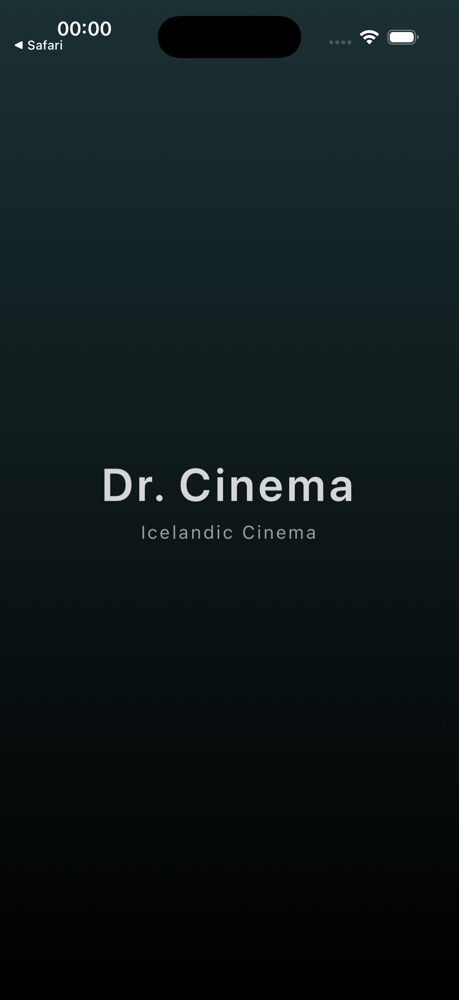

### Home Screen

| Home Screen                                                      | Movie Preview                                                                    |
| ---------------------------------------------------------------- | -------------------------------------------------------------------------------- |
| 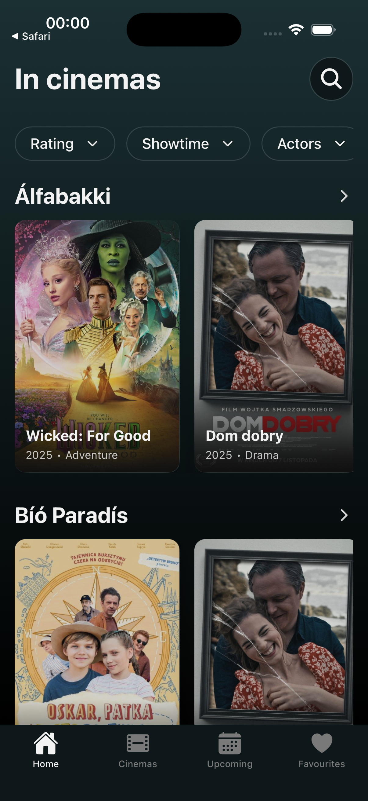 | 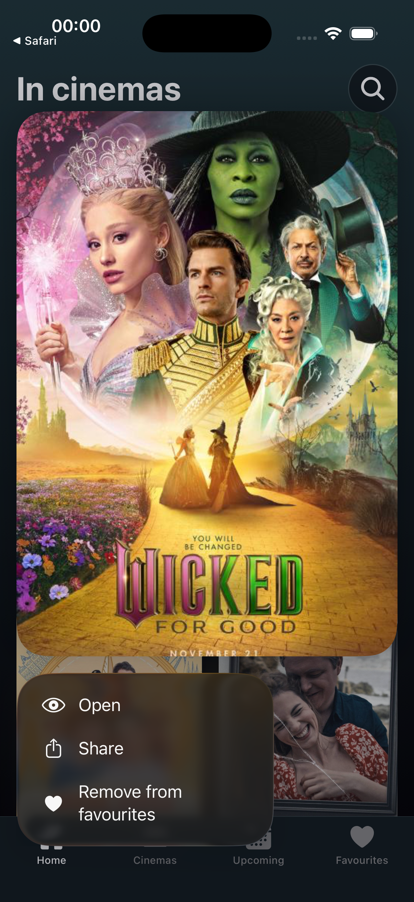 |

### Filters

| Showtime Filter                                                                       | Showtime Filter Active                                                                              |
| ------------------------------------------------------------------------------------- | --------------------------------------------------------------------------------------------------- |
| 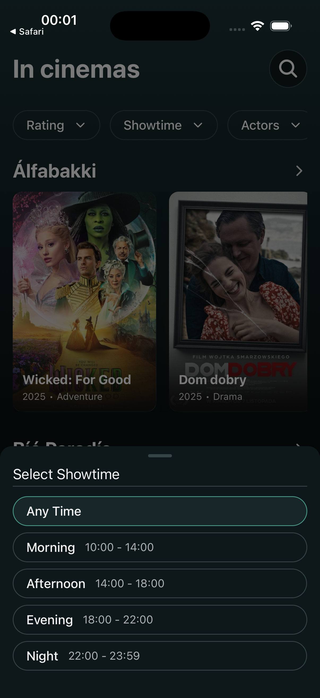 | 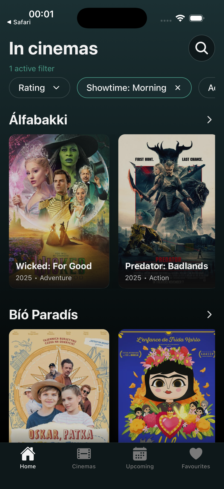 |

### Cinemas

| Cinemas List                                                           | Cinema Details                                                                |
| ---------------------------------------------------------------------- | ----------------------------------------------------------------------------- |
| 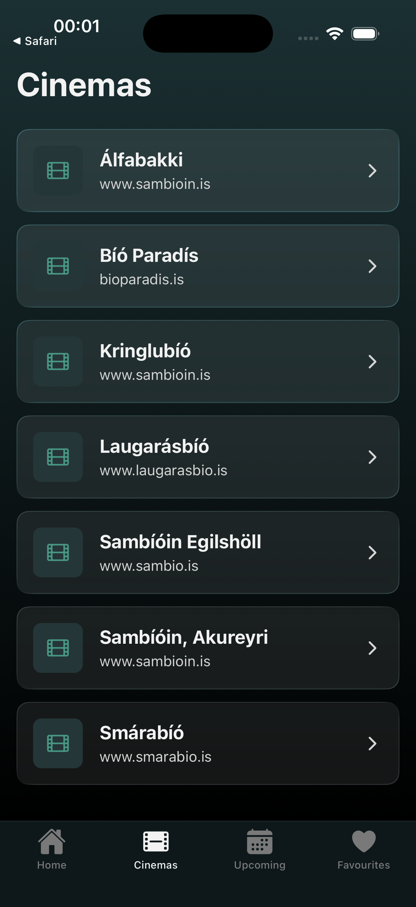 | 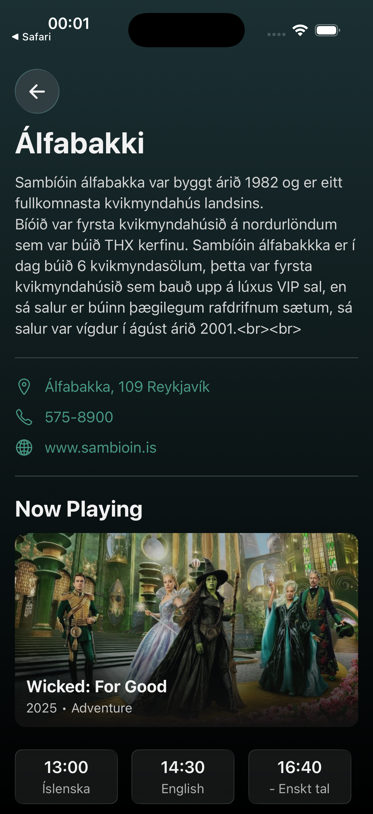 |

### Movie Details

| Movie Screen (Top)                                                         | Movie Screen (Bottom)                                                            |
| -------------------------------------------------------------------------- | -------------------------------------------------------------------------------- |
| 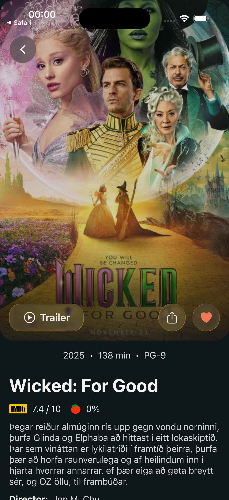 | 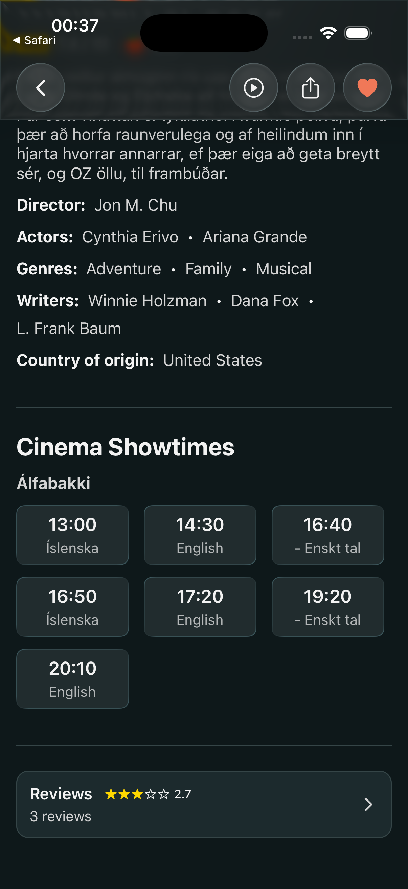 |

### Reviews

| Reviews List                                                                | Write Review                                                             |
| --------------------------------------------------------------------------- | ------------------------------------------------------------------------ |
| 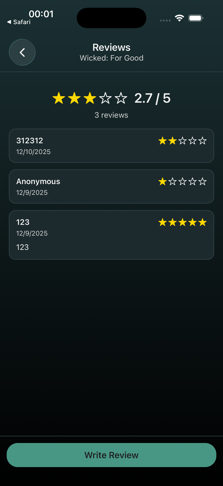 | 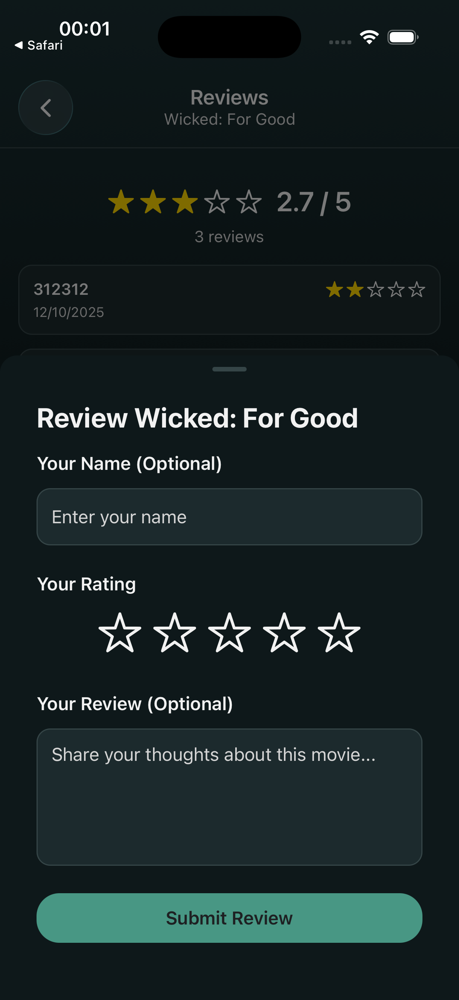 |

### Upcoming Movies

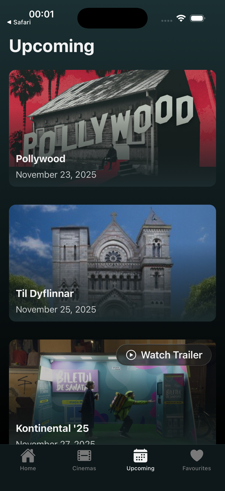

### Favourites

| Favourites                                                                   | Shared Favourites                                                                   |
| ---------------------------------------------------------------------------- | ----------------------------------------------------------------------------------- |
| 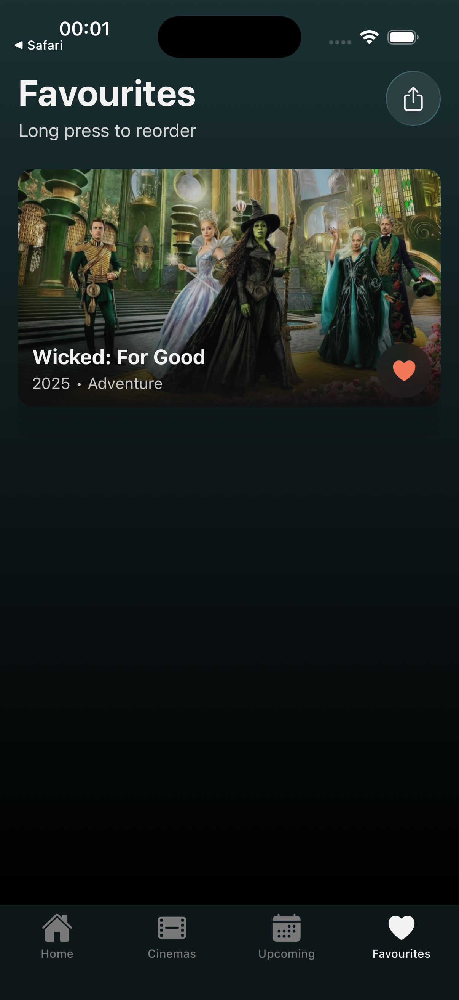 |  |

## Technologies Used

### Core Framework

| Technology   | Version  | Purpose                   |
| ------------ | -------- | ------------------------- |
| Expo         | ~54.0.28 | Development platform      |
| React Native | 0.81.5   | Mobile framework          |
| React        | 19.1.0   | UI library                |
| TypeScript   | ~5.9.2   | Type safety (strict mode) |

### Navigation & Routing

| Technology       | Version | Purpose               |
| ---------------- | ------- | --------------------- |
| Expo Router      | ~6.0.18 | File-based routing    |
| React Navigation | ^7.1.8  | Navigation primitives |

### State Management & Data Fetching

| Technology           | Version  | Purpose                     |
| -------------------- | -------- | --------------------------- |
| TanStack React Query | ^5.90.12 | Server state, caching, sync |
| Redux Toolkit        | ^2.11.1  | Client state management     |
| React Redux          | ^9.2.0   | React bindings for Redux    |
| AsyncStorage         | ^2.2.0   | Local persistence           |

### UI Components

| Technology                      | Version | Purpose                     |
| ------------------------------- | ------- | --------------------------- |
| Expo Linear Gradient            | ^15.0.8 | Gradient overlays           |
| Expo Glass Effect               | ~0.1.8  | Glass UI components         |
| Legend App List                 | ^2.0.16 | High-performance lists      |
| Expo Vector Icons               | ^15.0.3 | Icon library                |
| React Native Reanimated         | ~4.1.1  | Animations                  |
| @gorhom/bottom-sheet            | ^5.2.8  | Modal bottom sheets         |
| Moti                            | ^0.30.0 | Skeleton loading animations |
| react-native-draggable-flatlist | ^4.0.3  | Drag-to-reorder lists       |

### Native Features

| Technology   | Version | Purpose             |
| ------------ | ------- | ------------------- |
| Expo Haptics | ^15.0.8 | Haptic feedback     |
| Expo Sharing | ~14.0.8 | Native share dialog |
| Expo Linking | ~8.0.10 | Deep linking        |

### Media & Video

| Technology                  | Version | Purpose                  |
| --------------------------- | ------- | ------------------------ |
| React Native WebView        | 13.15.0 | Web content embedding    |
| React Native YouTube iFrame | ^2.4.1  | YouTube trailer playback |
| React Native SVG            | 15.12.1 | SVG rendering            |

### Developer Tools

| Technology        | Version | Purpose            |
| ----------------- | ------- | ------------------ |
| ESLint            | ^9.39.1 | Code linting       |
| Prettier          | ^3.6.2  | Code formatting    |
| TypeScript ESLint | ^8.47.0 | TypeScript linting |

## Platform Support

### Primary Development Platform

- **Platform**: iOS
- **Test Device**: iPhone 16 Pro (Simulator)
- **OS Version**: iOS 18.4

### Secondary Platform Testing

- **Platform**: Android
- **Test Device**: Pixel 9 Pro (Emulator)
- **OS Version**: Android 15
- **Testing Status**: Limited
- **Known Platform-Specific Issues**: None identified

## Project Structure

```
app/                          # Expo Router file-based routes
├── _layout.tsx              # Root layout (auth, theme, providers)
├── (tabs)/                  # Tab navigator group
│   ├── _layout.tsx         # Tab bar configuration
│   ├── index.tsx           # Home screen
│   ├── cinemas.tsx         # Cinemas list
│   ├── upcoming.tsx        # Upcoming movies
│   └── favourites.tsx      # Saved favorites
├── cinemas/
│   └── [id].tsx            # Cinema detail screen
├── movies/
│   ├── [id].tsx            # Movie detail screen
│   └── [id]/
│       └── reviews.tsx     # Reviews screen
├── favourites-shared.tsx   # Shared favorites screen
├── not-authenticated.tsx   # Auth error screen
└── +not-found.tsx          # 404 page

src/
├── api/                     # API layer
│   ├── client.ts           # HTTP client & authentication
│   ├── queryKeys.ts        # TanStack Query key factory
│   └── queryClient.ts      # Query client configuration
├── store/                   # Redux store
│   ├── store.ts            # Store configuration
│   ├── hooks.ts            # Typed useSelector/useDispatch
│   └── slices/             # Redux slices
│       ├── filtersSlice.ts  # Filter state management
│       ├── favoritesSlice.ts # Favorites with AsyncStorage
│       └── reviewsSlice.ts  # Reviews with AsyncStorage
├── hooks/                   # Custom React hooks
│   ├── api/                # Data fetching hooks
│   │   ├── useAuth.ts     # Authentication
│   │   ├── useMovies.ts   # Movie queries
│   │   ├── useCinemas.ts  # Cinema queries
│   │   ├── useMoviesByCinema.ts # Movies by cinema
│   │   ├── useUpcoming.ts # Upcoming movies
│   │   ├── useImages.ts   # TMDB images
│   │   ├── useGenres.ts   # Genre lookup
│   │   ├── useSearch.ts   # Search functionality
│   │   └── usePrefetch.ts # Data prefetching
│   ├── useTheme.tsx       # Theme hook
│   ├── useFilteredMovies.ts # Movie filtering logic
│   ├── useFavorites.ts    # Favorites hook
│   ├── useShare.ts        # Share with deep linking
│   └── useSharedFavourites.ts # Shared favorites parsing
├── screens/                 # Screen components
│   ├── HomeScreen.tsx
│   ├── CinemasScreen.tsx
│   ├── CinemaDetailScreen.tsx
│   ├── MovieScreen.tsx
│   ├── ReviewsScreen.tsx
│   ├── UpcomingScreen.tsx
│   ├── FavouritesScreen.tsx
│   ├── SharedFavouritesScreen.tsx
│   ├── NotAuthenticatedScreen.tsx
│   └── NotFoundScreen.tsx
├── components/              # Reusable UI components
│   ├── ui/                 # Base UI components
│   │   ├── Button/        # Button, LiquidButton
│   │   ├── Text.tsx       # Themeable text
│   │   ├── Skeleton.tsx   # Loading skeleton
│   │   ├── StarRating.tsx # Star rating component
│   │   ├── FilterChip.tsx # Filter chip
│   │   └── GlassChip.tsx  # Glass effect chip
│   ├── layout/             # Layout components
│   │   └── SafeAreaScreen.tsx
│   ├── movie/              # Movie-related components
│   │   ├── MovieCard.tsx
│   │   ├── MovieListItem.tsx
│   │   ├── MoviePosterSection.tsx
│   │   ├── MovieDetailsList.tsx
│   │   ├── FavoriteButton.tsx
│   │   ├── ReviewItem.tsx
│   │   ├── ReviewModal.tsx
│   │   ├── ReviewsSummaryCard.tsx
│   │   ├── UpcomingMovieCard.tsx
│   │   ├── EmptyFavourites.tsx
│   │   ├── EmptySharedFavourites.tsx
│   │   └── ...
│   ├── cinema/             # Cinema-related components
│   │   ├── CinemaListItem.tsx
│   │   ├── CinemaSection.tsx
│   │   ├── CinemaDetailHeader.tsx
│   │   ├── CinemaShowtimes.tsx
│   │   ├── BackButton.tsx
│   │   └── ...
│   ├── filters/            # Filter modal components
│   │   ├── ActorsFilter.tsx
│   │   ├── DirectorsFilter.tsx
│   │   ├── RatingFilter.tsx
│   │   ├── CertificateFilter.tsx
│   │   └── ShowtimeFilter.tsx
│   ├── bottom-sheet/       # Bottom sheet wrapper
│   ├── trailer/            # Trailer modal (YouTube)
│   ├── splash/             # Splash screen
│   ├── icons/              # Custom icons (IMDB, RT)
│   ├── Background.tsx      # Gradient background
│   ├── HomeFilters.tsx     # Home screen filters
│   └── SearchBar.tsx       # Animated search bar
├── constants/               # Theme, colors, design tokens
│   ├── Colors.ts
│   ├── DesignTokens.ts
│   └── fonts.ts
├── config/                  # Environment configuration
├── types/                   # TypeScript type definitions
│   └── api.ts              # API types (Movie, Cinema, etc.)
├── utils/                   # Utility functions
│   ├── haptics.ts          # Haptic feedback
│   ├── movieFilters.ts     # Filter logic
│   ├── trailerUtils.ts     # Trailer utilities
│   └── platform.ts         # Platform detection
└── providers/               # React context providers
    ├── QueryProvider.tsx
    └── StoreProvider.tsx
```

## Setup Instructions

### Prerequisites

- Node.js (v18 or higher)
- npm or yarn
- Expo CLI (`npm install -g expo-cli`)
- Xcode (for iOS development)
- Android Studio (for Android development)
- Expo Go app on physical device (optional)

### Environment Setup

1. Clone the repository:

    ```bash
    git clone <repository-url>
    cd T-488-MAPP-A3
    ```

2. Install dependencies:

    ```bash
    npm install
    ```

3. Create environment file:

    ```bash
    cp .env.example .env
    ```

4. Fill in the environment variables in `.env`:

    ```
    EXPO_PUBLIC_KVIKMYNDIR_API_BASE_URL=https://api.kvikmyndir.is
    EXPO_PUBLIC_KVIKMYNDIR_API_AUTH_USERNAME=<your-username>
    EXPO_PUBLIC_KVIKMYNDIR_API_AUTH_PASSWORD=<your-password>
    EXPO_PUBLIC_TMDB_API_KEY=<your-tmdb-api-key>
    ```

    - Register at [api.kvikmyndir.is](https://api.kvikmyndir.is) for API credentials
    - Get TMDB API key from [themoviedb.org](https://www.themoviedb.org/settings/api)

## Running the App

### Development

```bash
# Start Expo dev server
npm start

# Run on iOS simulator
npm run ios

# Run on Android emulator
npm run android

# Run in web browser
npm run web
```

### Code Quality

```bash
# Run all checks (lint + format + typecheck)
npm test

# Individual checks
npm run lint          # ESLint
npm run lint:fix      # ESLint with auto-fix
npm run typecheck     # TypeScript
npm run format        # Format code
npm run format:check  # Check formatting
```

## API Information

### kvikmyndir.is API

- **Base URL**: `https://api.kvikmyndir.is`
- **Authentication**: Basic HTTP Auth -> JWT token (24-hour validity)
- **Endpoints Used**:
    - `POST /authenticate` - Get access token
    - `GET /movies` - Currently showing movies
    - `GET /theaters` - Cinema listings
    - `GET /upcoming` - Upcoming releases
    - `GET /genres` - Genre list
    - `GET /search` - Full-text search

### TMDB API

- **Base URL**: `https://api.themoviedb.org/3`
- **Purpose**: High-quality movie backdrops and posters
- **Authentication**: Bearer token

### Deep Links

- **Scheme**: `drcinema://`
- **Movie**: `drcinema://movies/{id}` - Opens movie detail screen
- **Shared Favourites**: `drcinema://favourites-shared?ids=id1,id2,id3` - Opens shared favorites

## Known Issues

- Some movies may not have TMDB images available
- Authentication token is stored in memory only (cleared on app restart)

## Future Improvements

- [ ] Add localization (Icelandic/English)
- [ ] Add push notifications for new releases

## Author

- Milos Petrovic
- Nikulás Anthony Swain
- Sunna Einarsdóttir

## License

This project is part of a university assignment and is not licensed for public distribution.
